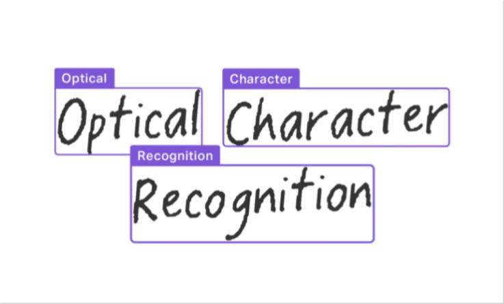

# Boostcamp-AI-Tech-Level2-HiBoostCamp
<!-- ALL-CONTRIBUTORS-BADGE:START - Do not remove or modify this section -->

<!-- ALL-CONTRIBUTORS-BADGE:END -->

- [부스트캠프 AI Tech](https://boostcamp.connect.or.kr/program_ai.html) - Level2. OCR 

# Introduction

 

OCR (Optimal Character Recognition) 기술은 사람이 직접 쓰거나 이미지 속에 있는 문자를 얻은 다음 이를 컴퓨터가 인식할 수 있도록 하는 기술로, 컴퓨터 비전 분야에서 현재 널리 쓰이는 대표적인 기술 중 하나이다. 종이 양식, 영수증, 문서, 주민등록증, 카드번호, 자동차 번호판과 같이 다양하게 사용된다.

본 프로젝트는 데이터셋을 직접 구축하고 다양한 최적화 방법을 이용하여 좋은 성능을 보이는 OCR 솔루션을 개발하는 것을 목표로 한다

-----
## Changes

**`2023-05-25`**: 
- Add Automatic Mixed Precision
- Change Argument Parsing Method (Json.config)
- Add Wandb Logging
- Add Validation Split
- Add Early Stopping & save best.pth

**`2023-05-24`**: 
- initial commit baseline Code
----
## requirements
- OS : Linux,
- GPU : Tesla V100
- mmdetection : 2.25.3
- CUDA : 11.0
- python : 3.8.5
- torch : 1.7.1
- torchvision : 0.8.2
- numpy==1.21.3

 

----
## 협업 규칙

- 커밋 메시지 컨벤션은 [conventional commit](https://www.conventionalcommits.org/en/v1.0.0/)을 따릅니다 
  - [commitizen](https://github.com/commitizen-tools/commitizen)을 사용하면 더욱 쉽게 커밋할 수 있습니다
- 작업은 기본적으로 별도의 브랜치를 생성하여 작업합니다. 작업이 완료되면 PR로 리뷰 받습니다
- PR 리뷰 후 머지 방식은 Squash & Merge를 따릅니다
  - Merge 전에 PR 제목을 되도록이면 convetional commit 형태로 만들어주세요

 

## Contributors ?

Thanks goes to these wonderful people ([emoji key](https://allcontributors.org/docs/en/emoji-key)):

<!-- ALL-CONTRIBUTORS-LIST:START - Do not remove or modify this section -->
<!-- prettier-ignore-start -->
<!-- markdownlint-disable -->
<table>
  <tr>
    <td align="center"><a href="https://github.com/ejrtks1020"> <b>강나훈</b></a> <a href="https://github.com/ejrtks1020" title="Code"></td>
    <td align="center"><a href="https://github.com/lijm1358"> <b>이종목</b></a> <a href="https://github.com/lijm1358" title="Code"></td>
    <td align="center"><a href="https://github.com/fneaplle"> <b>김희상</b></a> <a href="https://github.com/fneaplle" title="Code"></td>
    <td align="center"><a href="https://github.com/KimGeunUk"> <b>김근욱</b></a> <a href="https://github.com/KimGeunUk" title="Code"></td>
    <td align="center"><a href="https://github.com/jshye"> <b>정성혜</b></a> <a href="https://github.com/jshye" title="Code"></td>    
  </tr>
</table>

<!-- markdownlint-restore -->
<!-- prettier-ignore-end -->

<!-- ALL-CONTRIBUTORS-LIST:END -->

This project follows the [all-contributors](https://github.com/all-contributors/all-contributors) specification. Contributions of any kind welcome!
